## 1. 통계학

### 1-1) 확률과 분포 : 확률의 개념과 응용, 확률분포, 확률분포의 개념과 응용

1. 확률의 기본 개념


2. 확률 공리 (Kolmogorov)


3. 조건부 확률과 독립


4. 확률분포

 4-1) 이산 확률분포

 


 4-2) 연속 확률분포

 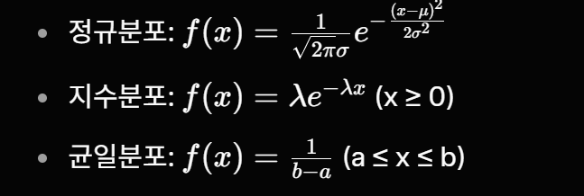


 4-3) 실기에서 자주 나오는 응용
  - 이항분포로 A/B 테스트 유의성 판단
  - 포아송으로 하루 고객 문의 건수 예측
  - 정규분포로 신뢰구간 계산


```python
# 확률의 개념과 응용 + 확률분포 예제
from scipy.stats import binom, norm, poisson, expon
import numpy as np

np.random.seed(42)
# 이항분포 응용 (A/B 테스트)
print("이항 PMF (성공 3회):", binom.pmf(3, n=10, p=0.4))
print("누적확률 (3회 이하):", binom.cdf(3, n=10, p=0.4))

# 정규분포 응용
print("180 이상 확률:", 1 - norm.cdf(180, loc=170, scale=10))

# 포아송 응용 (고객 문의)
print("정확히 5건:", poisson.pmf(5, mu=4.2))

# 지수분포 응용 (대기시간)
print("8분 이상 대기 확률:", 1 - expon.cdf(8, scale=5))
```

    이항 PMF (성공 3회): 0.21499084799999987
    누적확률 (3회 이하): 0.3822806016
    180 이상 확률: 0.15865525393145707
    정확히 5건: 0.1633158674349063
    8분 이상 대기 확률: 0.20189651799465536
    


```python
# 1. 이항분포로 A/B 테스트 유의성 판단 #
import numpy as np
from scipy import stats

# 실제 상황 가정
np.random.seed(42)
n_a = 2500      # 버전 A 노출 수
n_b = 2500      # 버전 B 노출 수 

conv_a = 148    # A에서 전환된 수 → 전환율 ~ 5.92%
conv_b = 192    # B에서 전환된 수 → 전환율 ~ 7.68%

p_a = conv_a / n_a
p_b = conv_b / n_b

# pooled proportion (귀무가설 하에서 공통 비율 추정)
p_pool = (conv_a + conv_b) / (n_a + n_b)

# 표준오차
se = np.sqrt(p_pool * (1 - p_pool) * (1/n_a + 1/n_b))

# z-통계량
z = (p_b - p_a) / se

# 양측 검정 p-value
p_value = 2 * (1 - stats.norm.cdf(abs(z)))

# 결과 출력
print("A/B 테스트 결과 (이항분포 기반 z-검정)")
print(f"버전 A 전환율 : {p_a:.4f} ({conv_a} / {n_a})")
print(f"버전 B 전환율 : {p_b:.4f} ({conv_b} / {n_b})")
print(f"차이          : {p_b - p_a:.4f}")
print(f"z-값          : {z:.4f}")
print(f"p-value       : {p_value:.6f}")
print("-" * 50)
print(f"결론 (a = 0.05) : {'유의미한 차이 있음 →  B가 더 좋음' if p_value < 0.05 else '통계적으로 유의미한 차이 없음'}")

```

    A/B 테스트 결과 (이항분포 기반 z-검정)
    버전 A 전환율 : 0.0592 (148 / 2500)
    버전 B 전환율 : 0.0768 (192 / 2500)
    차이          : 0.0176
    z-값          : 2.4718
    p-value       : 0.013445
    --------------------------------------------------
    결론 (a = 0.05) : 유의미한 차이 있음 →  B가 더 좋음
    


```python
# 포아송으로 하루 고객 문의 건수 예측

from scipy import stats

# 하루 평균 문의 건수 (λ) → 과거 데이터로 추정한 값
lambda_day = 7.2

print(f"포아송 분포 예측 (하루 평균 문의 건수 λ = {lambda_day})")
print("-" * 50)

# 주요 확률 계산
print(f"0건 발생할 확률           : {stats.poisson.pmf(0, lambda_day):.4f}")
print(f"1~3건 발생할 확률         : {stats.poisson.cdf(3, lambda_day) - stats.poisson.pmf(0, lambda_day):.4f}")
print(f"5건 이하 발생할 확률      : {stats.poisson.cdf(5, lambda_day):.4f}")
print(f"10건 이상 발생할 확률     : {1 - stats.poisson.cdf(9, lambda_day):.4f}")
print(f"최대 95% 확률 범위 내 건수 : {stats.poisson.ppf(0.025, lambda_day):.0f} ~ {stats.poisson.ppf(0.975, lambda_day):.0f}건")

print("\n특히 중요한 값들")
print(f"평균 (= 분산)             : {lambda_day:.1f} 건")
print(f"상위 10% 구간 시작점      : {stats.poisson.ppf(0.90, lambda_day):.0f}건 이상")
```

    포아송 분포 예측 (하루 평균 문의 건수 λ = 7.2)
    --------------------------------------------------
    0건 발생할 확률           : 0.0007
    1~3건 발생할 확률         : 0.0712
    5건 이하 발생할 확률      : 0.2759
    10건 이상 발생할 확률     : 0.1904
    최대 95% 확률 범위 내 건수 : 2 ~ 13건
    
    특히 중요한 값들
    평균 (= 분산)             : 7.2 건
    상위 10% 구간 시작점      : 11건 이상
    


```python
# 정규분포로 신뢰구간 계산 (표본 → 모평균 추정)

import numpy as np
from scipy import stats

np.random.seed(42)

# 모의 데이터 생성 (실제로는 측정 데이터)
# 예: 20대 여성 키 데이터라고 가정
mu_true = 162.5      # (알 수 없는) 모평균
sigma_true = 6.8     # (알 수 없는) 모표준편차
n = 85               # 표본 크기

sample = np.random.normal(mu_true, sigma_true, n)

# 점추정 & 구간추정
x_bar = sample.mean()
s = sample.std(ddof=1)          # 표본 표준편차 (불편추정)
se = s / np.sqrt(n)             # 표준오차

# t-분포 사용 (모집단 분산 모를 때 → 대부분 실무에서 이렇게 함)
ci_95 = stats.t.interval(0.95, df=n-1, loc=x_bar, scale=se)
ci_99 = stats.t.interval(0.99, df=n-1, loc=x_bar, scale=se)

print("정규분포 기반 신뢰구간 계산 (모평균 추정)")
print("-" * 50)
print(f"표본 크기 (n)      : {n}")
print(f"표본 평균 (점추정) : {x_bar:.2f} cm")
print(f"표본 표준편차      : {s:.2f} cm")
print(f"표준오차 (SE)      : {se:.2f} cm")
print()
print(f"95% 신뢰구간       : ({ci_95[0]:.2f}, {ci_95[1]:.2f}) cm")
print(f"99% 신뢰구간       : ({ci_99[0]:.2f}, {ci_99[1]:.2f}) cm")
print()
print("해석: 우리는 95% 확신으로 모평균(진짜 평균 키)이 "
      f"{ci_95[0]:.2f} ~ {ci_95[1]:.2f} cm 사이에 있다고 말할 수 있습니다.")
```

    정규분포 기반 신뢰구간 계산 (모평균 추정)
    --------------------------------------------------
    표본 크기 (n)      : 85
    표본 평균 (점추정) : 161.73 cm
    표본 표준편차      : 6.46 cm
    표준오차 (SE)      : 0.70 cm
    
    95% 신뢰구간       : (160.34, 163.12) cm
    99% 신뢰구간       : (159.88, 163.58) cm
    
    해석: 우리는 95% 확신으로 모평균(진짜 평균 키)이 160.34 ~ 163.12 cm 사이에 있다고 말할 수 있습니다.
    

### 1-2) 탐색적 데이터 분석 : 범주형 변수의 EDA, 수치형 변수의 EDA, 기타 탐색적 데이터 분석

1. 범주형 변수 EDA
- 빈도표, 교차표 (crosstab)
- 막대그래프, 파이차트
- 카이제곱 검정으로 독립성 확인


```python
import warnings
warnings.filterwarnings(action='ignore')

import pandas as pd
import seaborn as sns
import matplotlib.pyplot as plt
import numpy as np
from scipy import stats   # ← 카이제곱 검정을 위해 추가

np.random.seed(42)

df = pd.DataFrame({
    'gender': np.random.choice(['M', 'F'], 1000),
    'job'   : np.random.choice(['학생', '회사원', '자영업', '무직'], 1000),
    'target': np.random.choice([0, 1], 1000, p=[0.7, 0.3])
})

# ────────────────────────────────────────────────
# 1. 범주형 변수 EDA (기존 부분)
# ────────────────────────────────────────────────
print("1. gender와 target의 정규화된 빈도표 (행 비율)")
print(pd.crosstab(df['gender'], df['target'], normalize='index').round(4))
print()

print("2. job과 target의 빈도표 (절대값)")
print(pd.crosstab(df['job'], df['target']))
print()

# 시각화
plt.figure(figsize=(8, 5))
sns.countplot(x='job', hue='target', data=df)
plt.title('범주형 변수 EDA - 직업별 target 분포')
plt.xticks(rotation=45)
plt.tight_layout()
plt.show()

# ────────────────────────────────────────────────
# 2. 카이제곱 독립성 검정 추가
# ────────────────────────────────────────────────
print("═" * 60)
print("카이제곱 독립성 검정 (Chi-Square Test of Independence)")
print("═" * 60)

# (1) gender와 target 간 독립성 검정
contingency_gender = pd.crosstab(df['gender'], df['target'])
chi2_g, p_g, dof_g, expected_g = stats.chi2_contingency(contingency_gender)

print("\n[gender vs target]")
print("교차표:")
print(contingency_gender)
print(f"\nChi-square 통계량 : {chi2_g:.4f}")
print(f"p-value           : {p_g:.6f}")
print(f"자유도            : {dof_g}")
print(f"기대빈도 (참고)   :\n{np.round(expected_g, 2)}")
print("-" * 50)
if p_g < 0.05:
    print("→ 귀무가설 기각 : gender와 target은 통계적으로 유의미한 관계가 있다.")
else:
    print("→ 귀무가설 채택 : gender와 target 사이에 유의미한 관계가 없다 (독립).")


# (2) job과 target 간 독립성 검정
contingency_job = pd.crosstab(df['job'], df['target'])
chi2_j, p_j, dof_j, expected_j = stats.chi2_contingency(contingency_job)

print("\n[job vs target]")
print("교차표:")
print(contingency_job)
print(f"\nChi-square 통계량 : {chi2_j:.4f}")
print(f"p-value           : {p_j:.6f}")
print(f"자유도            : {dof_j}")
print(f"기대빈도 (참고)   :\n{np.round(expected_j, 2)}")
print("-" * 50)
if p_j < 0.05:
    print("→ 귀무가설 기각 : job과 target은 통계적으로 유의미한 관계가 있다.")
else:
    print("→ 귀무가설 채택 : job과 target 사이에 유의미한 관계가 없다 (독립).")
```

    1. gender와 target의 정규화된 빈도표 (행 비율)
    target       0       1
    gender                
    F       0.6824  0.3176
    M       0.7041  0.2959
    
    2. job과 target의 빈도표 (절대값)
    target    0   1
    job            
    무직      145  66
    자영업     184  75
    학생      180  87
    회사원     184  79
    
    


    
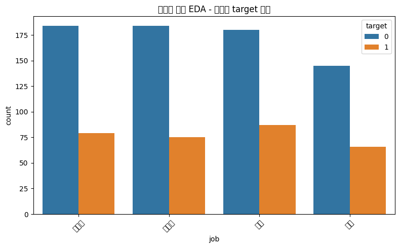
    


    ════════════════════════════════════════════════════════════
    카이제곱 독립성 검정 (Chi-Square Test of Independence)
    ════════════════════════════════════════════════════════════
    
    [gender vs target]
    교차표:
    target    0    1
    gender          
    F       348  162
    M       345  145
    
    Chi-square 통계량 : 0.4571
    p-value           : 0.498960
    자유도            : 1
    기대빈도 (참고)   :
    [[353.43 156.57]
     [339.57 150.43]]
    --------------------------------------------------
    → 귀무가설 채택 : gender와 target 사이에 유의미한 관계가 없다 (독립).
    
    [job vs target]
    교차표:
    target    0   1
    job            
    무직      145  66
    자영업     184  75
    학생      180  87
    회사원     184  79
    
    Chi-square 통계량 : 0.9027
    p-value           : 0.824778
    자유도            : 3
    기대빈도 (참고)   :
    [[146.22  64.78]
     [179.49  79.51]
     [185.03  81.97]
     [182.26  80.74]]
    --------------------------------------------------
    → 귀무가설 채택 : job과 target 사이에 유의미한 관계가 없다 (독립).
    

2. 수치형 변수 EDA
- 기초통계량 : 평균, 중앙값, 표준편차, 사분위수
- 히스토그램, 박스플롯, 산점도
- 왜도(skewness), 첨도(kurtosis)
- 상관계수(Pearson, Spearman)


```python
import warnings
warnings.filterwarnings(action='ignore')

import pandas as pd
import seaborn as sns
import matplotlib.pyplot as plt
import numpy as np
from scipy import stats

np.random.seed(42)

# 데이터 생성 (기존 + target 포함)
df = pd.DataFrame({
    'gender': np.random.choice(['M', 'F'], 1000),
    'job'   : np.random.choice(['학생', '회사원', '자영업', '무직'], 1000),
    'target': np.random.choice([0, 1], 1000, p=[0.7, 0.3])
})

# 수치형 변수 추가
df['age']   = np.random.randint(20, 65, 1000)
df['income'] = np.random.normal(4500, 1200, 1000)

# ────────────────────────────────────────────────
# 1. 기초 통계량 출력
# ────────────────────────────────────────────────
print("수치형 변수 기초통계량")
print(df[['age', 'income']].describe().round(2))
print()

# ────────────────────────────────────────────────
# 2. 왜도(Skewness)와 첨도(Kurtosis) 계산
# ────────────────────────────────────────────────
print("왜도와 첨도")
print(f"age   - 왜도: {df['age'].skew():.4f}   첨도: {df['age'].kurtosis():.4f}")
print(f"income - 왜도: {df['income'].skew():.4f}   첨도: {df['income'].kurtosis():.4f}")
print()
# 해석 참고:
# 왜도:  0에 가까울수록 정규분포에 가까움 / 양수 → 오른쪽 꼬리 길음 / 음수 → 왼쪽 꼬리 길음
# 첨도:  3에 가까울수록 정규분포 / >3 → 뾰족(Leptokurtic) / <3 → 납작(Platykurtic)

# ────────────────────────────────────────────────
# 3. 상관계수 (Pearson & Spearman)
# ────────────────────────────────────────────────
print("상관계수 행렬 (Pearson)")
print(df[['age', 'income', 'target']].corr(method='pearson').round(3))
print()

print("상관계수 행렬 (Spearman - 순위상관)")
print(df[['age', 'income', 'target']].corr(method='spearman').round(3))
print()

# ────────────────────────────────────────────────
# 4. 시각화
# ────────────────────────────────────────────────

# (1) income 히스토그램 + KDE (기존)
plt.figure(figsize=(10, 5))
sns.histplot(df['income'], kde=True, bins=30, color='skyblue')
plt.title('수치형 변수 EDA - income 분포 (히스토그램 + KDE)')
plt.xlabel('income')
plt.ylabel('빈도')
plt.grid(True, alpha=0.3)
plt.show()

# (2) target별 age 박스플롯 (기존)
plt.figure(figsize=(8, 5))
sns.boxplot(x='target', y='age', data=df, palette='Set2')
plt.title('target별 age 분포 (박스플롯)')
plt.xlabel('target (0: 비전환, 1: 전환)')
plt.ylabel('age')
plt.show()

# (3) age vs income 산점도 + target으로 색상 구분 (추가)
plt.figure(figsize=(10, 6))
sns.scatterplot(
    x='age', 
    y='income', 
    hue='target', 
    style='target',
    size='target',
    sizes=(40, 120),
    alpha=0.7,
    palette='coolwarm',
    data=df
)
plt.title('age vs income 산점도 (target으로 색상·크기 구분)')
plt.xlabel('age')
plt.ylabel('income')
plt.grid(True, alpha=0.3)
plt.legend(title='target')
plt.show()

# (4) 추가: 상관계수 히트맵 (시각적 확인용)
plt.figure(figsize=(7, 5))
sns.heatmap(
    df[['age', 'income', 'target']].corr(method='pearson'),
    annot=True,
    cmap='coolwarm',
    vmin=-1, vmax=1,
    fmt='.2f',
    linewidths=0.5
)
plt.title('Pearson 상관계수 히트맵')
plt.show()
```

    수치형 변수 기초통계량
               age   income
    count  1000.00  1000.00
    mean     42.33  4558.27
    std      12.89  1212.19
    min      20.00   985.26
    25%      31.00  3766.64
    50%      42.00  4610.83
    75%      54.00  5342.55
    max      64.00  8412.59
    
    왜도와 첨도
    age   - 왜도: -0.0206   첨도: -1.1778
    income - 왜도: -0.0946   첨도: -0.0059
    
    상관계수 행렬 (Pearson)
              age  income  target
    age     1.000   0.006   0.012
    income  0.006   1.000   0.029
    target  0.012   0.029   1.000
    
    상관계수 행렬 (Spearman - 순위상관)
              age  income  target
    age     1.000   0.021   0.012
    income  0.021   1.000   0.023
    target  0.012   0.023   1.000
    
    


    
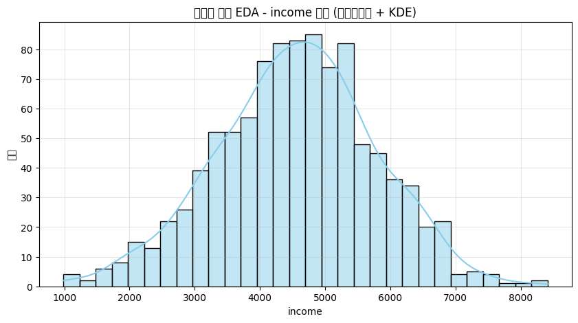
    


    
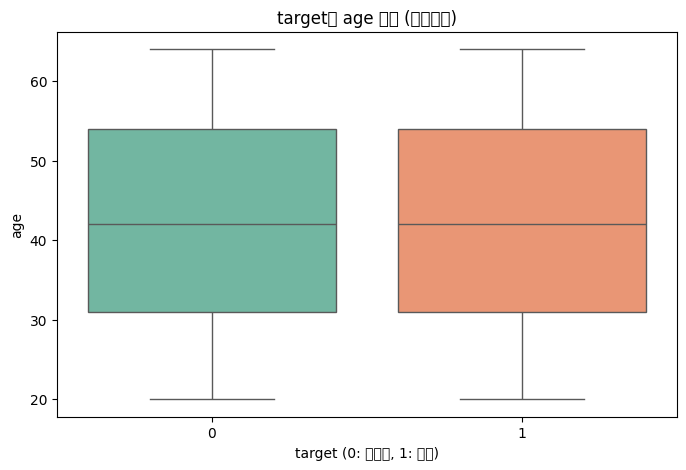
    


    
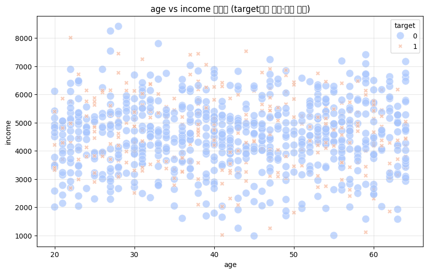
    


    
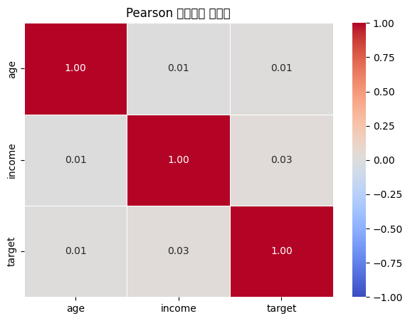
    


3. 기타 EDA
- 결측치/이상치 시각화(missingno, seaborn heatmap)
- Pairplot, Heatmap(상관관계)


```python
import pandas as pd
import seaborn as sns
import matplotlib.pyplot as plt
import numpy as np

np.random.seed(42)
df = pd.DataFrame({
    'gender': np.random.choice(['M','F'],1000),
    'job': np.random.choice(['학생','회사원','자영업','무직'],1000),
    'target': np.random.choice([0,1],1000,p=[0.7,0.3]),
    'age': np.random.randint(20,65,1000),
    'income': np.random.normal(4500,1200,1000)
})

# 결측치·이상치 인위 추가
df.loc[np.random.choice(df.index,70),'age'] = np.nan
df.loc[np.random.choice(df.index,55),'income'] = np.nan
extreme = np.random.choice(df.index,8)
df.loc[extreme,'income'] = [15000,18000,-2000,22000,25000,-5000,30000,1]

# 결측치 heatmap
plt.figure(figsize=(8,5))
sns.heatmap(df.isnull(), cbar=False, cmap='viridis', yticklabels=False)
plt.title('결측치 Heatmap (노랑 = 결측)')
plt.show()

# 이상치 boxplot
plt.figure(figsize=(10,4))
plt.subplot(121); sns.boxplot(y=df['age'])
plt.title('age'); plt.subplot(122); sns.boxplot(y=df['income'])
plt.title('income (이상치 보임)'); plt.tight_layout(); plt.show()

# 상관관계 heatmap + pairplot
sns.heatmap(df[['age','income','target']].corr().round(2), annot=True, cmap='coolwarm')
plt.title('상관관계 히트맵'); plt.show()

sns.pairplot(df[['age','income','target']], hue='target', height=2.5)
plt.show()
```


    
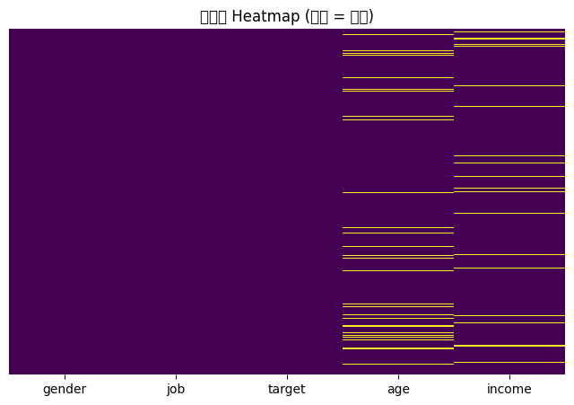
    


    
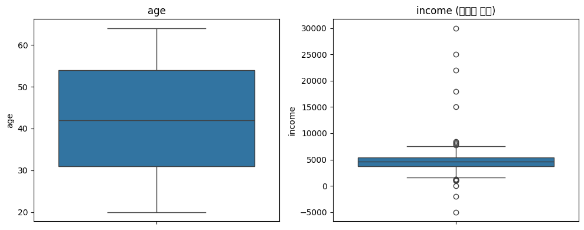
    


    
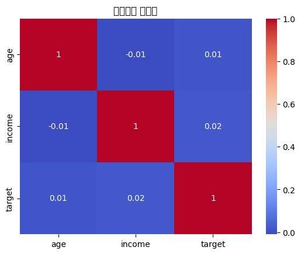
    


    
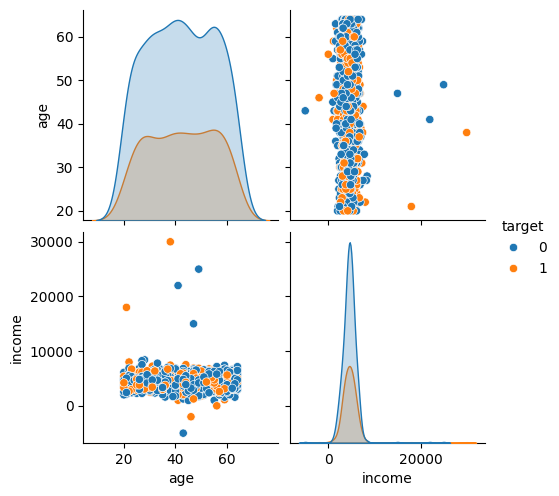
    


### 1-3) 추정과 검정 : 모집단과 표본, 모수와 통계량, 점추정과 구간추정, 가설검정 개념, T-test, ANOVA, Chi-Sqaure Test, 기타 추정과 검정

1. 모집단 vs 표본, 모수 vs 통계량


```python
# 모수 추정 예제
pop_mean = 170
sample = np.random.normal(170, 10, 100)
print("표본 평균(점추정):", sample.mean())
```

    표본 평균(점추정): 171.10702246124492
    

2. 점추정과 구간추정


```python
from scipy import stats
mean = sample.mean()
std = sample.std(ddof=1)
n = len(sample)
ci = stats.t.interval(0.95, df=n-1, loc=mean, scale=std/np.sqrt(n))
print("95% 구간추정:", ci)
```

    95% 구간추정: (np.float64(169.15502608386754), np.float64(173.0590188386223))
    

3. 가설검정 기본 흐름


4. T-test


```python
# 일표본 t-test
t_stat, p = stats.ttest_1samp(sample, popmean=165)
print("일표본 t-test p-value:", p)

# 독립 이표본 t-test
group_a = np.random.normal(170, 10, 50)
group_b = np.random.normal(165, 10, 50)
t_stat, p = stats.ttest_ind(group_a, group_b)
print("독립 이표본 t-test p-value:", p)
```

    일표본 t-test p-value: 1.2618848553467415e-08
    독립 이표본 t-test p-value: 0.0017466539365844555
    

5. ANOVA(분산분석)
- 일원배치 : F = MSB / MSW
- 다중비교 : Tukey, Bonferroni 


```python
# oneway_anova_tukey.py
# 일원배치 분산분석 + Tukey HSD 사후검정 (가장 간단한 버전)

import numpy as np
from scipy import stats
import pandas as pd
from statsmodels.stats.multicomp import pairwise_tukeyhsd

# ──────────────── 1. 가상 데이터 만들기 ────────────────
np.random.seed(42)  # 결과 재현 가능하게

# 세 가지 수업 방식 후 시험 점수 (각 그룹 25명)
group_A = np.random.normal(loc=65, scale=8, size=25)   # 전통 수업
group_B = np.random.normal(loc=72, scale=8, size=25)   # 플립러닝
group_C = np.random.normal(loc=78, scale=9, size=25)   # 게임 기반 학습

# 평균 미리 확인 (참고용)
print("각 그룹 평균:")
print(f" A (전통)   : {group_A.mean():.1f}")
print(f" B (플립)   : {group_B.mean():.1f}")
print(f" C (게임)   : {group_C.mean():.1f}")
print("-" * 40)

# ──────────────── 2. 일원배치 분산분석 (scipy) ────────────────
f_stat, p_value = stats.f_oneway(group_A, group_B, group_C)

print("One-way ANOVA 결과")
print(f"F 통계량    : {f_stat:.2f}")
print(f"p-value      : {p_value:.6f}")

if p_value < 0.05:
    print("결과: 적어도 한 그룹은 평균이 다르다! (유의미)")
else:
    print("결과: 세 그룹 평균이 통계적으로 같다")
print("-" * 40)

# ──────────────── 3. Tukey HSD 사후검정 (statsmodels) ────────────────
# 긴 형태 데이터프레임으로 변환 (Tukey가 좋아하는 형식)
data = pd.DataFrame({
    'score': np.concatenate([group_A, group_B, group_C]),
    'group': ['A']*25 + ['B']*25 + ['C']*25
})

tukey_result = pairwise_tukeyhsd(
    endog=data['score'],       # 종속변수
    groups=data['group'],      # 그룹 변수
    alpha=0.05                 # 유의수준
)

print("Tukey HSD 사후검정 결과")
print(tukey_result)

# 간단 요약 출력 (필요한 사람만 보세요)
print("\n간단 해석 요약:")
print(tukey_result.summary())
```

    각 그룹 평균:
     A (전통)   : 63.7
     B (플립)   : 69.7
     C (게임)   : 79.0
    ----------------------------------------
    One-way ANOVA 결과
    F 통계량    : 23.06
    p-value      : 0.000000
    결과: 적어도 한 그룹은 평균이 다르다! (유의미)
    ----------------------------------------
    Tukey HSD 사후검정 결과
    Multiple Comparison of Means - Tukey HSD, FWER=0.05
    ===================================================
    group1 group2 meandiff p-adj  lower   upper  reject
    ---------------------------------------------------
         A      B   6.0085 0.0262 0.5892 11.4279   True
         A      C  15.2629    0.0 9.8435 20.6823   True
         B      C   9.2544 0.0003  3.835 14.6738   True
    ---------------------------------------------------
    
    간단 해석 요약:
    Multiple Comparison of Means - Tukey HSD, FWER=0.05
    ===================================================
    group1 group2 meandiff p-adj  lower   upper  reject
    ---------------------------------------------------
         A      B   6.0085 0.0262 0.5892 11.4279   True
         A      C  15.2629    0.0 9.8435 20.6823   True
         B      C   9.2544 0.0003  3.835 14.6738   True
    ---------------------------------------------------
    

6. Chi-Square Test


```python
obs = np.array([[30, 20], [25, 35]])
chi2, p, _, _ = stats.chi2_contingency(obs)
print("Chi-Square p-value:", p)
```

    Chi-Square p-value: 0.08482185440586089
    

7. 기타 검정
- Wilcoxon rank-sum(비모수), Kolmogorov-Smirnov(분포 검정)


```python
import numpy as np
from scipy import stats

np.random.seed(42)

# 데이터
group_a = np.random.normal(10, 3, 45)
group_b = np.random.normal(12.5, 3.5, 55)
group_c = np.random.exponential(scale=4, size=80) + 5

# Wilcoxon rank-sum
u_stat, u_p = stats.mannwhitneyu(group_a, group_b, alternative='two-sided')

# 2-sample KS
ks2_stat, ks2_p = stats.ks_2samp(group_a, group_b)

# 1-sample KS - 정규분포
ks_norm_stat, ks_norm_p = stats.kstest(group_a, 'norm', args=(group_a.mean(), group_a.std()))

# 1-sample KS - 지수분포
ks_exp_stat, ks_exp_p = stats.kstest(group_c, 'expon', args=(5, 4))

print("=== 비모수 및 분포 검정 결과 요약 ===")
print(f"Wilcoxon rank-sum     p = {u_p:.6f}   → {'유의' if u_p < 0.05 else '비유의'}")
print(f"2-sample KS           p = {ks2_p:.6f}   → {'분포 다름' if ks2_p < 0.05 else '비슷'}")
print(f"1-sample KS (vs 정규) p = {ks_norm_p:.6f}   → {'정규' if ks_norm_p >= 0.05 else '비정규'}")
print(f"1-sample KS (vs 지수) p = {ks_exp_p:.6f}   → {'지수' if ks_exp_p >= 0.05 else '비지수'}")
```

    === 비모수 및 분포 검정 결과 요약 ===
    Wilcoxon rank-sum     p = 0.000001   → 유의
    2-sample KS           p = 0.000005   → 분포 다름
    1-sample KS (vs 정규) p = 0.965336   → 정규
    1-sample KS (vs 지수) p = 0.442527   → 지수
    

### 1-4) 시계열 분석 : Time Series Decomposition, Smoothing, Exponential Smoothing, 기타 시계열 분석

1. Time Series Decomposition


```python
import pandas as pd
import matplotlib.pyplot as plt
from statsmodels.tsa.seasonal import seasonal_decompose
import numpy as np

dates = pd.date_range('2023-01-01', periods=120, freq='ME')
ts = pd.Series(np.random.normal(100, 10, 120) + np.sin(np.arange(120)/12*2*np.pi)*20, index=dates)
decomp = seasonal_decompose(ts, model='additive', period=12)
decomp.plot()
plt.suptitle('Time Series Decomposition')
plt.show()
```


    
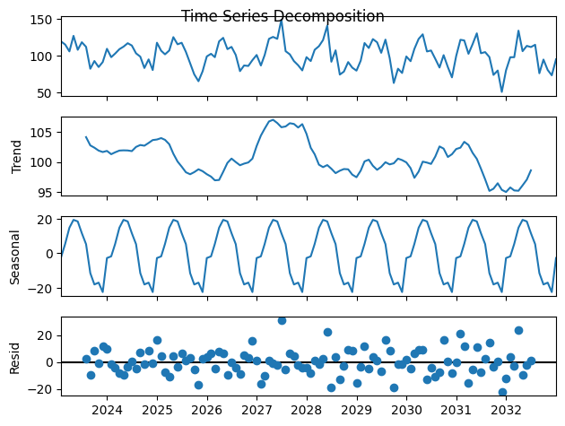
    


2. Smoothing
- 이동평균 : Simple Moving Average (SMA)
- Weighted Moving Average


```python
sma = ts.rolling(window=3).mean()
print("3개월 이동평균 첫 5개:\n", sma.head())
```

    3개월 이동평균 첫 5개:
     2023-01-31           NaN
    2023-02-28           NaN
    2023-03-31    112.934516
    2023-04-30    115.570446
    2023-05-31    113.182234
    Freq: ME, dtype: float64
    

3. Exponential Smoothing


```python
from statsmodels.tsa.holtwinters import ExponentialSmoothing

model = ExponentialSmoothing(ts, trend='add', seasonal='add', seasonal_periods=12).fit()
forecast = model.forecast(12)
print("Holt-Winters 12개월 예측:\n", forecast)
```

    Holt-Winters 12개월 예측:
     2033-01-31     97.855814
    2033-02-28    103.977427
    2033-03-31    111.444493
    2033-04-30    117.657097
    2033-05-31    114.849172
    2033-06-30    109.602944
    2033-07-31    103.964239
    2033-08-31     84.819247
    2033-09-30     80.811997
    2033-10-31     80.381711
    2033-11-30     74.663022
    2033-12-31     94.602673
    Freq: ME, dtype: float64
    

4. 기타 시계열
- ARIMA(p,d,q), SARIMA
- ACF/PACF로 p,q 결정
- Stationarity 검사 (ADF test)


```python
import numpy as np
import pandas as pd
import matplotlib.pyplot as plt
from statsmodels.tsa.stattools import adfuller
from statsmodels.graphics.tsaplots import plot_acf, plot_pacf
from statsmodels.tsa.arima.model import ARIMA
from statsmodels.tsa.statespace.sarimax import SARIMAX

np.random.seed(42)
n = 120
dates = pd.date_range('2023-01-01', periods=n, freq='ME')
trend = np.linspace(50, 120, n)
seasonal = 20 * np.sin(np.arange(n) * 2 * np.pi / 12)
ts = pd.Series(trend + seasonal + np.random.normal(0, 8, n), index=dates)

# 시각화
ts.plot(figsize=(10,4), title='원본 시계열')
plt.show()

# ADF 검정
def adf(x, msg):
    res = adfuller(x)
    print(f"{msg}  p-value: {res[1]:.4f}  → {'정상' if res[1]<0.05 else '비정상'}")

adf(ts, "원본")
adf(ts.diff().dropna(), "1차 차분")

# ACF / PACF
fig, ax = plt.subplots(2,1,figsize=(10,5))
plot_acf(ts.diff().dropna(), ax=ax[0], lags=36, title='ACF (diff=1)')
plot_pacf(ts.diff().dropna(), ax=ax[1], lags=36, title='PACF (diff=1)')
plt.tight_layout(); plt.show()

# ARIMA & SARIMA
arima = ARIMA(ts, order=(1,1,1)).fit()
sarima = SARIMAX(ts, order=(1,1,1), seasonal_order=(1,1,1,12)).fit(disp=False)

print(f"ARIMA AIC: {arima.aic:.1f}")
print(f"SARIMA AIC: {sarima.aic:.1f}")

# 예측
fc_steps = 12
plt.figure(figsize=(11,5))
ts[-48:].plot(label='실제')
arima.get_forecast(fc_steps).predicted_mean.plot(label='ARIMA')
sarima.get_forecast(fc_steps).predicted_mean.plot(label='SARIMA')
plt.title('12개월 예측 비교'); plt.legend(); plt.grid(alpha=0.3)
plt.show()
```


    
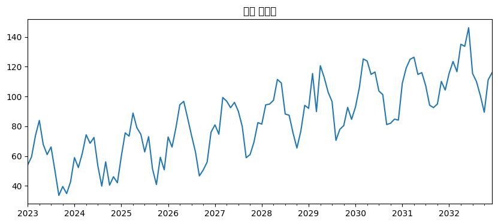
    


    원본  p-value: 0.9902  → 비정상
    1차 차분  p-value: 0.0000  → 정상
    


    
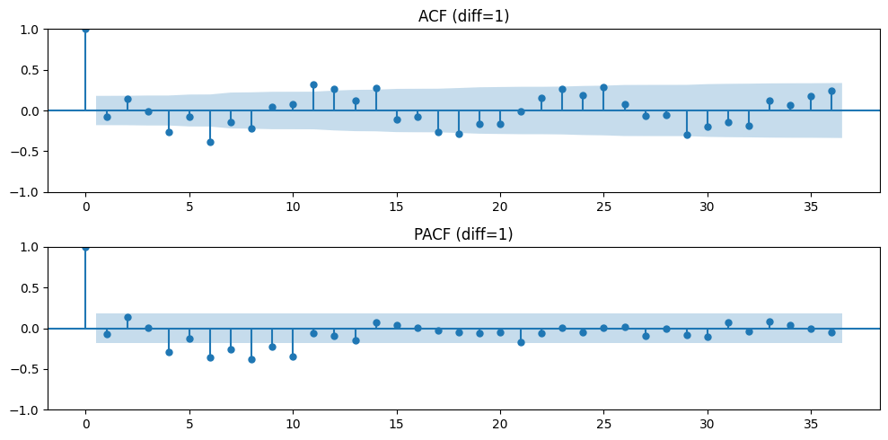
    


    ARIMA AIC: 943.9
    SARIMA AIC: 770.3
    


    
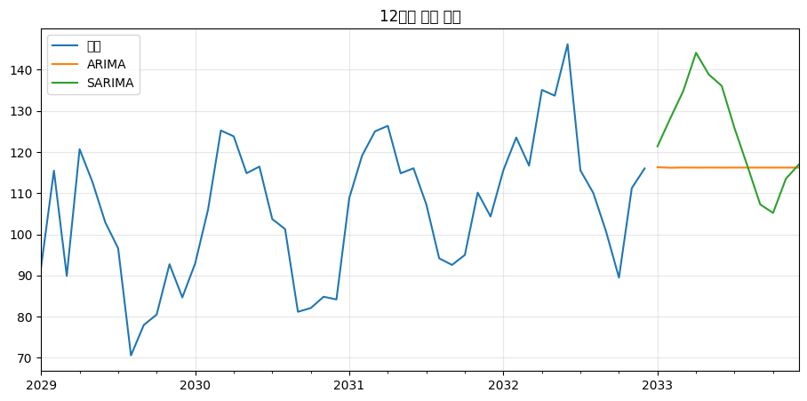
    


## 2. 데이터 처리 및 시각화

### 2-1) Data Integration
- pd.concat(행/열 결합)
- pd.merge(join: inner, left, right, outer)
- SQL JOIN과 동일 개념


```python
import pandas as pd

df1 = pd.DataFrame({'id': [1,2,3], 'name': ['A','B','C']})
df2 = pd.DataFrame({'id': [2,3,4], 'score': [80,90,85]})
df3 = pd.DataFrame({'id': [1,2,5], 'dept': ['영업','개발','마케팅']})

# merge 예제
print("merge inner:\n", pd.merge(df1, df2, on='id', how='inner'))
print("merge left:\n",  pd.merge(df1, df2, on='id', how='left'))

# concat 예제
print("\nconcat 행 방향:\n", pd.concat([df1, df2], ignore_index=True))
print("\nconcat 열 방향:\n", pd.concat([df1, df3['dept']], axis=1))

# 서로 다른 열 행 결합
print("\nconcat diff columns:\n", pd.concat([df1, df2], ignore_index=True, sort=False))
```

    merge inner:
        id name  score
    0   2    B     80
    1   3    C     90
    merge left:
        id name  score
    0   1    A    NaN
    1   2    B   80.0
    2   3    C   90.0
    
    concat 행 방향:
        id name  score
    0   1    A    NaN
    1   2    B    NaN
    2   3    C    NaN
    3   2  NaN   80.0
    4   3  NaN   90.0
    5   4  NaN   85.0
    
    concat 열 방향:
        id name dept
    0   1    A   영업
    1   2    B   개발
    2   3    C  마케팅
    
    concat diff columns:
        id name  score
    0   1    A    NaN
    1   2    B    NaN
    2   3    C    NaN
    3   2  NaN   80.0
    4   3  NaN   90.0
    5   4  NaN   85.0
    

### 2-2) 데이터 Cleansing : Missing Value 탐지 및 처리, Outlier의 탐지 및 처리, 기타 데이터 Cleansing

1. Missing Value
- 탐지 : df.isnull().sum(). missingno.matrix
- 삭제: dropna
- 대체 : fillna(mean, median, mode, KNNImputer)
- 보간 : interpolate


```python
import pandas as pd
import numpy as np
from sklearn.impute import KNNImputer

np.random.seed(42)
df = pd.DataFrame({
    'age':    np.random.randint(20, 60, 12),
    'income': np.random.normal(4000, 800, 12),
    'score':  np.random.uniform(60, 95, 12)
})

# 결측치 추가
df.iloc[[2,5,8],0] = np.nan
df.iloc[[1,4,7,10],1] = np.nan
df.iloc[[3,6,9],2] = np.nan

print("결측치 개수:\n", df.isnull().sum())

# 1. 삭제
df.dropna(inplace=True)          # 또는 df = df.dropna()

# 2. 단순 대체
df['age']    = df['age'].fillna(df['age'].mean())
df['income'] = df['income'].fillna(df['income'].median())
df['score']  = df['score'].fillna(df['score'].mode()[0])

# 3. KNN 대체 (원본 복사 후)
df_knn = df.copy()
df_knn[:] = KNNImputer(n_neighbors=3).fit_transform(df_knn)

# 4. 선형 보간 (시계열/순서 데이터용)
df_interp = df.interpolate(method='linear')
```

    결측치 개수:
     age       3
    income    4
    score     3
    dtype: int64
    

2. Outlier
- 탐지 : Z-score(|z| > 3), IQR(1.5 x IQR 초과), Isolation Forest
- 처리 : 삭제, winsorizing, 변환


```python
import pandas as pd
import numpy as np
from sklearn.ensemble import IsolationForest

np.random.seed(42)
df = pd.DataFrame({'value': np.random.normal(100, 15, 150)})

# 이상치 인위 추가
out_idx = np.random.choice(150, 8)
df.loc[out_idx, 'value'] = [220, 250, 15, -40, 300, -80, 280, 5]

# 1. IQR 방식
Q1, Q3 = df['value'].quantile([0.25, 0.75])
IQR = Q3 - Q1
iqr_mask = (df['value'] < Q1 - 1.5*IQR) | (df['value'] > Q3 + 1.5*IQR)
print("IQR 이상치 개수:", iqr_mask.sum())

# 2. Z-score 방식
z = np.abs((df['value'] - df['value'].mean()) / df['value'].std())
print("Z > 3 이상치 개수:", (z > 3).sum())

# 3. Isolation Forest
iso = IsolationForest(contamination=0.05, random_state=42)
df['is_outlier'] = iso.fit_predict(df[['value']]) == -1
print("IsolationForest 이상치 개수:", df['is_outlier'].sum())

# 처리 예시
# (1) 삭제
df_clean = df[~df['is_outlier']]

# (2) Winsorizing (clip)
bounds = df['value'].quantile([0.05, 0.95])
df['value_clip'] = df['value'].clip(*bounds)

# (3) log 변환 (양수 가정)
df['value_log'] = np.log1p(df['value'].clip(lower=0))
```

    IQR 이상치 개수: 9
    Z > 3 이상치 개수: 6
    IsolationForest 이상치 개수: 8
    

3. 기타 데이터 Cleansing


```python
# 중복 제거
df = pd.DataFrame({'id':[1,1,2], 'val':[10,10,20]})
df.drop_duplicates(inplace=True)
```

### 2-3) Transformation : 분포의 모양에 따른 변환, Data Scaling, 데이터 형태 변환, 기타 Transformation, 가변수의 생성

1. 분포 모양 변환 
- 로그 : np.log1p(오른쪽 치우침)
- 제곱근, Box-Cox(scipy.stats.boxcox)


```python
import numpy as np
import pandas as pd
import matplotlib.pyplot as plt
from scipy import stats

np.random.seed(42)
data = np.random.lognormal(2.5, 1.2, 8000)
data = np.append(data, [data.max()*k for k in [4,6,8]])

df = pd.DataFrame({'original': data})

df['log']    = np.log1p(df['original'])
df['sqrt']   = np.sqrt(df['original'])
df['boxcox'], _ = stats.boxcox(df['original'])

# 시각화
df.hist(bins=60, figsize=(10,7), layout=(2,2), 
        column=['original','log','sqrt','boxcox'],
        sharex=False, sharey=False)
plt.tight_layout()
plt.show()

print("왜도 비교:")
print(df.skew().round(3))
```


    
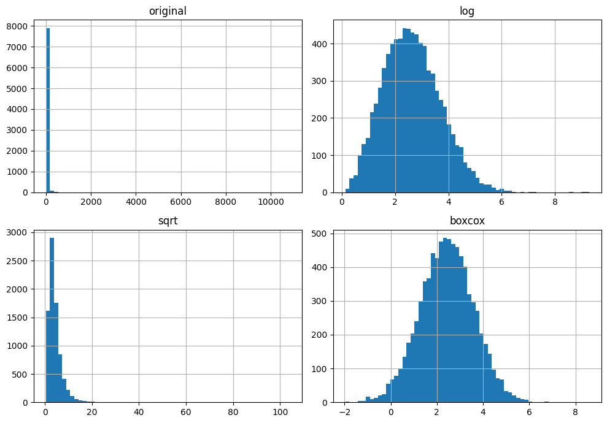
    


    왜도 비교:
    original    50.485
    log          0.414
    sqrt         8.572
    boxcox      -0.002
    dtype: float64
    

2. Data Scaling


```python
import pandas as pd
import numpy as np
from sklearn.preprocessing import MinMaxScaler, StandardScaler, RobustScaler

# 1. 샘플 데이터 생성 (마지막 값 1000은 이상치)
data = {
    'Value': [10, 20, 30, 40, 50, 1000] 
}
df = pd.DataFrame(data)

print("--- 원본 데이터 ---")
print(df)
print("\n")

# 2. 스케일러 객체 생성
minmax_scaler = MinMaxScaler()
standard_scaler = StandardScaler()
robust_scaler = RobustScaler()

# 3. 데이터 스케일링 적용 (fit_transform 사용)
# 주의: scikit-learn은 2차원 배열을 기대하므로 괄호를 두 번 써서 DataFrame 형태로 넘겨줍니다.
df['MinMax'] = minmax_scaler.fit_transform(df[['Value']])
df['Standard'] = standard_scaler.fit_transform(df[['Value']])
df['Robust'] = robust_scaler.fit_transform(df[['Value']])

# 4. 결과 출력 (가독성을 위해 소수점 3자리까지 표기)
print("--- 스케일링 결과 비교 ---")
print(df.round(3))
```

    --- 원본 데이터 ---
       Value
    0     10
    1     20
    2     30
    3     40
    4     50
    5   1000
    
    
    --- 스케일링 결과 비교 ---
       Value  MinMax  Standard  Robust
    0     10    0.00    -0.502    -1.0
    1     20    0.01    -0.475    -0.6
    2     30    0.02    -0.447    -0.2
    3     40    0.03    -0.419     0.2
    4     50    0.04    -0.392     0.6
    5   1000    1.00     2.235    38.6
    

3. 데이터 형태 변환
- pivot, melt, stack/unstack
- groupby + agg


```python
import pandas as pd

# 샘플 데이터 (날짜, 제품, 판매량)
df = pd.DataFrame({
    'Date': ['1월', '1월', '2월', '2월'],
    'Item': ['A', 'B', 'A', 'B'],
    'Sales': [100, 200, 150, 250]
})

# 1. Pivot: 표를 가로로 넓게 (Long -> Wide)
pv = df.pivot(index='Date', columns='Item', values='Sales')

# 2. Melt: 표를 세로로 길게 (Wide -> Long)
ml = pv.reset_index().melt(id_vars='Date', value_name='Sales')

# 3. Stack/Unstack: 인덱스 층 옮기기
# set_index로 멀티인덱스 생성 후 사용
st = df.set_index(['Date', 'Item']).unstack() # 행에 있던 Item을 열로 보냄
us = st.stack()                               # 열에 있던 Item을 다시 행으로 내림

# 4. Groupby + Agg: 그룹별 요약 통계
gp = df.groupby('Item').agg({'Sales': ['sum', 'mean']})

# 출력 확인
print("--- PIVOT ---\n", pv)
print("\n--- GROUPBY ---\n", gp)
```

    --- PIVOT ---
     Item    A    B
    Date          
    1월    100  200
    2월    150  250
    
    --- GROUPBY ---
          Sales       
           sum   mean
    Item             
    A      250  125.0
    B      450  225.0
    

4. 가변수 생성 (One-hot Encoding)


```python
df = pd.DataFrame({'job':['학생', '회사원', '학생']})
df = pd.get_dummies(df, columns=['job'], drop_first=True)
print("One-hot Encoding 결과:\n", df)
```

    One-hot Encoding 결과:
        job_회사원
    0    False
    1     True
    2    False
    

### 2-4) 파생변수의 생성 : 다양한 방법의 파생변수 생성
- 날짜 : dt.year, dt.month, dt.dayofweek, is_weekend
- 문자열 : len(), split(), 정규식
- 수치 : ratio = col1 / col2, binning(pd.cut)
- 도메인 지식 기반 (예 : $BMI = weight / height^2$)


```python
import pandas as pd
import numpy as np

# 0. 샘플 데이터 생성
df = pd.DataFrame({
    'date': pd.to_datetime(['2023-01-01', '2023-03-15', '2023-07-08']),
    'user_info': ['ID_101_Seoul', 'ID_202_Busan', 'ID_303_Jeju'],
    'height_cm': [170, 180, 160],
    'weight_kg': [70, 85, 50],
    'score': [45, 92, 78]
})

# 1. 날짜 파생변수 (Year, Month, DayOfWeek, Weekend)
df['year'] = df['date'].dt.year
df['month'] = df['date'].dt.month
df['day_name'] = df['date'].dt.day_name() # 요일 이름
df['is_weekend'] = df['date'].dt.dayofweek.isin([5, 6]) # 5:토, 6:일

# 2. 문자열 파생변수 (Length, Split, Regex)
df['info_len'] = df['user_info'].str.len()
df['city'] = df['user_info'].str.split('_').str[-1] # '_'로 나누고 마지막 요소 추출
df['user_id'] = df['user_info'].str.extract(r'(\d+)') # 정규식: 숫자만 추출

# 3. 수치 파생변수 (Ratio, Binning)
# Ratio: 점수 대비 몸무게 비율 (예시)
df['score_ratio'] = df['score'] / df['weight_kg']
# Binning: 점수 구간 나누기 (Low, Mid, High)
df['grade'] = pd.cut(df['score'], bins=[0, 60, 80, 100], labels=['Low', 'Mid', 'High'])

# 4. 도메인 지식 기반 (BMI 계산)
# BMI = kg / m^2
df['BMI'] = df['weight_kg'] / (df['height_cm'] / 100) ** 2

# 결과 출력
print(df[['date', 'is_weekend', 'city', 'user_id', 'grade', 'BMI']].round(2))
```

            date  is_weekend   city user_id grade    BMI
    0 2023-01-01        True  Seoul     101   Low  24.22
    1 2023-03-15       False  Busan     202  High  26.23
    2 2023-07-08        True   Jeju     303   Mid  19.53
    

### 2-5) Sampling : Sampling 방법
- 단순랜덤 : df.sample(frac=0.7)
- 계층적 : stratified (sklearn.model_selection.StratifiedShuffleSplit)
- 과소/과대 샘플링 (imbalanced-learn) : SMOTE, RandomUnderSampler


```python
import pandas as pd
import numpy as np
from sklearn.datasets import make_classification
from sklearn.model_selection import train_test_split

# 라이브러리 설치 여부 확인을 위해 try-except 사용
try:
    from imblearn.over_sampling import SMOTE
    from imblearn.under_sampling import RandomUnderSampler
except ImportError:
    print("에러: imbalanced-learn 설치가 필요합니다. '!pip install imbalanced-learn'을 실행하세요.")

# 0. 불균형 데이터 생성 (0번 클래스 90%, 1번 클래스 10%)
X, y = make_classification(n_samples=1000, n_features=2, n_redundant=0, 
                           weights=[0.9, 0.1], random_state=42)
df = pd.DataFrame(X, columns=['F1', 'F2'])
df['Target'] = y

# 1. 단순 랜덤 샘플링 (pandas)
df_sample = df.sample(frac=0.7, random_state=42)

# 2. 계층적 분할 (sklearn) - Target 비율 유지하며 분할
X_train, X_test, y_train, y_test = train_test_split(
    X, y, test_size=0.3, stratify=y, random_state=42
)

# 3. Under/Over Sampling (imblearn)
# UnderSampling: 다수를 소수에 맞춤
rus = RandomUnderSampler(random_state=42)
X_under, y_under = rus.fit_resample(X, y)

# SMOTE: 소수를 합성하여 늘림
smote = SMOTE(random_state=42)
X_over, y_over = smote.fit_resample(X, y)

# --- 결과 요약 출력 ---
print(f"1. 원본 데이터 크기: {len(df)} (1번 클래스: {sum(y)})")
print(f"2. 랜덤 샘플링 크기 (70%): {len(df_sample)}")
print(f"3. 계층적 분할 후 Test 내 1번 비중: {sum(y_test)/len(y_test):.2%}")
print(f"4. Under-sampling 결과: {len(y_under)}개 (0과 1 비율 동일)")
print(f"5. SMOTE Over-sampling 결과: {len(y_over)}개 (0과 1 비율 동일)")
```

    1. 원본 데이터 크기: 1000 (1번 클래스: 106)
    2. 랜덤 샘플링 크기 (70%): 700
    3. 계층적 분할 후 Test 내 1번 비중: 10.67%
    4. Under-sampling 결과: 212개 (0과 1 비율 동일)
    5. SMOTE Over-sampling 결과: 1788개 (0과 1 비율 동일)
    

### 2-6) 문자열 Data의 전처리 : 문자형의 분리
- split, strip, replace
- 정규식 : re.sub(r'[^가-힣a-zA-Z0-9]', '', text)
- 한국어 : konlpy (Okt), mecab 형태소 분석


```python
df = pd.DataFrame({'text':['    Hello World!   ', '안녕하세요123', 'Python@2024']})
df['clean'] = df['text'].str.lower().str.strip().str.replace(r'[^a-z가-힣0-9]', '', regex=True)
print(df)
```

                      text       clean
    0      Hello World!     helloworld
    1             안녕하세요123    안녕하세요123
    2          Python@2024  python2024
    

### 2-7) 시각화 및 리포트 작성
- Matplotlib + Seaborn 기본
- Plotly (인터렉티브)
- 리포트 : Jupyter Notebook → HTML/PDF 변환, Sweetviz / Pandas-Profiling 자동 리포트


```python
# seaborn 간단 리포틑
sns.pairplot(df[['height', 'weight', 'bmi']])
plt.show()
```

## 3. 머신러닝

### 3-1) 머신러닝 개요 : 머신러닝 기본 개념 및 머신러닝 방법론 (Supervised learning, Unsupervised learning)
- Supervised : 정답(y) 있음 (회귀, 분류)
- Unsupervised : 정담 없음 (군집, 차원축소)
- Semi-supervised, Reinforcement


```python
from sklearn.datasets import make_classification

X, y = make_classification(n_samples=500, n_features=10, random_state=42)
print("Supervised 예제 shape:", X.shape, y.shape)
```

    Supervised 예제 shape: (500, 10) (500,)
    

### 3-2) 머신러닝 관련 최적화 : 다양한 머신러닝 관련 최적화 방법


```python
from sklearn.linear_model import SGDClassifier
from sklearn.neural_network import MLPClassifier
from sklearn.datasets import make_classification
from sklearn.model_selection import train_test_split

# 0. 샘플 데이터 생성
X, y = make_classification(n_samples=1000, n_features=10, random_state=42)
X_train, X_test, y_train, y_test = train_test_split(X, y, test_size=0.2)

# 1. SGDClassifier (경사하강법 기반 선형 분류기)
sgd = SGDClassifier(
    loss='log_loss',      # 손실함수: Cross-Entropy (분류)
    penalty='l2',         # 과적합 방지: L2 Regularization
    alpha=0.0001,         # Regularization 강도
    learning_rate='constant', eta0=0.01, # 경사하강법: 학습률(η) 설정
    max_iter=1000,
    tol=1e-3,             # Early Stopping: 개선되지 않으면 중단
    early_stopping=True   # 과적합 방지: Early Stopping 활성화
)

# 2. MLPClassifier (딥러닝 구조의 다층 퍼셉트론)
mlp = MLPClassifier(
    hidden_layer_sizes=(10,), 
    solver='adam',        # 옵티마이저: Adam (이미지의 Adam/RMSprop 해당)
    activation='relu',
    alpha=0.01,           # 과적합 방지: L2 Regularization
    batch_size=32,
    learning_rate_init=0.001,
    early_stopping=True,  # 과적합 방지: Early Stopping
    random_state=42
)

# 학습 실행
sgd.fit(X_train, y_train)
mlp.fit(X_train, y_train)

# 결과 확인
print(f"SGD Accuracy: {sgd.score(X_test, y_test):.4f}")
print(f"MLP Accuracy: {mlp.score(X_test, y_test):.4f}")
```

    SGD Accuracy: 0.8500
    MLP Accuracy: 0.8650
    

### 3-3) Feature Selection 
- Filter : 상관계수, Chi-square, ANOVA
- Wrapper : Forward/Backward, RFE
- Embedded : Lasso, RandomForest feature_importances_, XGBoost


```python
import pandas as pd
import numpy as np
from sklearn.datasets import load_iris
from sklearn.feature_selection import SelectKBest, f_classif, RFE, SelectFromModel
from sklearn.ensemble import RandomForestClassifier
from sklearn.linear_model import LogisticRegression

# 데이터 로드
X, y = load_iris(return_X_y=True)
cols = np.array(['sl', 'sw', 'pl', 'pw']) # 해결책: numpy array로 변환

# 1. Filter (ANOVA)
filt = SelectKBest(f_classif, k=2).fit(X, y)
# numpy array는 불리언 인덱싱을 지원합니다.
print("Filter:", cols[filt.get_support()]) 

# 2. Wrapper (RFE)
wrap = RFE(LogisticRegression(max_iter=200), n_features_to_select=2).fit(X, y)
print("Wrapper:", cols[wrap.get_support()])

# 3. Embedded (RandomForest)
embed_model = RandomForestClassifier().fit(X, y)
embed = SelectFromModel(embed_model, prefit=True)
print("Embedded:", cols[embed.get_support()])
```

    Filter: ['pl' 'pw']
    Wrapper: ['pl' 'pw']
    Embedded: ['pl' 'pw']
    

### 3-4) Feature Extraction
- PCA : 공분산 행렬 고유벡터
- LDA (지도)
- t-SNE, UMAP (시각화용)


```python
import pandas as pd
import matplotlib.pyplot as plt
from sklearn.datasets import load_iris
from sklearn.decomposition import PCA
from sklearn.discriminant_analysis import LinearDiscriminantAnalysis as LDA
from sklearn.manifold import TSNE
# umap은 별도 설치 필요: pip install umap-learn
try:
    from umap import UMAP
except ImportError:
    UMAP = None

# 0. 데이터 준비
iris = load_iris()
X, y = iris.data, iris.target
target_names = iris.target_names

# 1. PCA (비지도): 데이터의 분산을 최대한 보존하는 고유벡터 추출
pca = PCA(n_components=2)
X_pca = pca.fit_transform(X)

# 2. LDA (지도): 클래스 간 분별력을 최대화 (타겟 y 필요)
lda = LDA(n_components=2)
X_lda = lda.fit_transform(X, y)

# 3. t-SNE (시각화): 데이터 간의 거리를 확률적으로 보존 (비선형)
tsne = TSNE(n_components=2, random_state=42)
X_tsne = tsne.fit_transform(X)

# 4. UMAP (시각화): t-SNE보다 빠르고 데이터의 전역 구조를 잘 유지
X_umap = UMAP(n_components=2).fit_transform(X) if UMAP else None

# --- 결과 시각화 ---
methods = [('PCA', X_pca), ('LDA', X_lda), ('t-SNE', X_tsne)]
if X_umap is not None: methods.append(('UMAP', X_umap))

plt.figure(figsize=(15, 4))
for i, (name, res) in enumerate(methods, 1):
    plt.subplot(1, len(methods), i)
    for j, c in zip(range(3), ['r', 'g', 'b']):
        plt.scatter(res[y==j, 0], res[y==j, 1], c=c, label=target_names[j], s=20)
    plt.title(name)
plt.tight_layout()
plt.show()
```


    
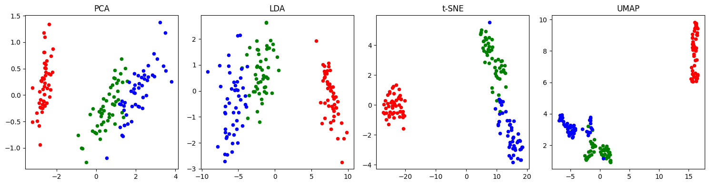
    


### 3-5) Clustering : Hierachical Clustering, K-Means Clustering, 기타 Clustering

1. Hierachical
- 거리 : Euclidean, Manhattan
- 연결법 : Single, Complete, Average
- 덴드로그램으로 군집 수 결정


```python
import pandas as pd
import matplotlib.pyplot as plt
from scipy.cluster.hierarchy import dendrogram, linkage, fcluster
from sklearn.datasets import load_iris

# 0. 데이터 준비 (Iris 데이터 사용)
iris = load_iris()
X = iris.data[:10]  # 시각화를 위해 상위 10개 샘플만 사용

# 1. 거리 측정 및 연결법 설정 (linkage)
# metric: 'euclidean', 'cityblock'(Manhattan)
# method: 'single', 'complete', 'average', 'ward'
Z = linkage(X, method='complete', metric='euclidean')

# 2. 덴드로그램 시각화 (군집 수 결정 도구)
plt.figure(figsize=(10, 5))
dendrogram(Z, labels=[f'ID_{i}' for i in range(len(X))])
plt.title("Hierarchical Clustering Dendrogram")
plt.xlabel("Sample ID")
plt.ylabel("Distance")
plt.axhline(y=1.5, color='r', linestyle='--') # 자르는 기준선(Threshold)
plt.show()

# 3. 군집 할당 (fcluster)
# criterion='distance' (거리 기준) 또는 'maxclust' (군집 개수 기준)
clusters = fcluster(Z, t=2, criterion='maxclust')
print(f"할당된 군집 결과: {clusters}")
```


    
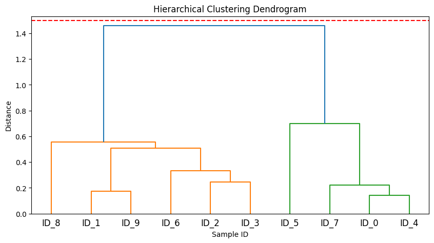
    


    할당된 군집 결과: [2 1 1 1 2 2 1 2 1 1]
    

2. K-Means
- Elbow method (inertia)
- Silhouette score
- 알고리즘 : 초기 중심 → 할당 → 재계산 반복


```python
import matplotlib.pyplot as plt
from sklearn.cluster import KMeans
from sklearn.metrics import silhouette_score
from sklearn.datasets import load_iris

X, _ = load_iris(return_X_y=True)
inertia, sil_scores = [], []
k_range = range(2, 6)

for k in k_range:
    # 1. 알고리즘: 중심 설정 -> 할당 -> 재계산 반복 (KMeans 자동 수행)
    model = KMeans(n_clusters=k, n_init=10, random_state=42).fit(X)
    
    # 2. Elbow: 군집 내 오차 제곱합(Inertia) 저장
    inertia.append(model.inertia_)
    
    # 3. Silhouette: 군집 응집도/분리도 점수 저장
    sil_scores.append(silhouette_score(X, model.labels_))

# --- 결과 시각화 ---
fig, (ax1, ax2) = plt.subplots(1, 2, figsize=(10, 4))

ax1.plot(k_range, inertia, 'go-'); ax1.set_title('Elbow (Inertia)') # 꺾이는 지점 찾기
ax2.plot(k_range, sil_scores, 'bo-'); ax2.set_title('Silhouette Score') # 높은 점수 찾기

plt.show()
```


    
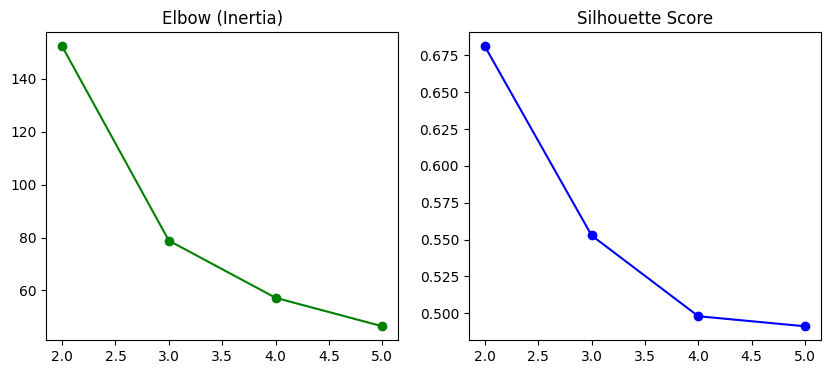
    


3. 기타
- DBSCAN (밀도)
- GMM


```python
import matplotlib.pyplot as plt
from sklearn.datasets import make_moons
from sklearn.cluster import DBSCAN
from sklearn.mixture import GaussianMixture

# 0. 데이터 준비 (초승달 모양 데이터)
X, _ = make_moons(n_samples=300, noise=0.05, random_state=42)

# 1. DBSCAN (밀도 기반)
# eps: 반경, min_samples: 최소 이웃 수
dbscan = DBSCAN(eps=0.2, min_samples=5).fit(X)
db_labels = dbscan.labels_

# 2. GMM (확률 분포 기반)
# n_components: 군집 수
gmm = GaussianMixture(n_components=2, random_state=42).fit(X)
gmm_labels = gmm.predict(X)

# --- 결과 시각화 ---
plt.figure(figsize=(10, 4))

plt.subplot(1, 2, 1)
plt.scatter(X[:, 0], X[:, 1], c=db_labels, cmap='viridis', s=20)
plt.title("DBSCAN (Density-based)") # 밀도가 높은 덩어리를 찾음

plt.subplot(1, 2, 2)
plt.scatter(X[:, 0], X[:, 1], c=gmm_labels, cmap='plasma', s=20)
plt.title("GMM (Distribution-based)") # 타원형 확률 분포로 나눔

plt.tight_layout()
plt.show()
```


    
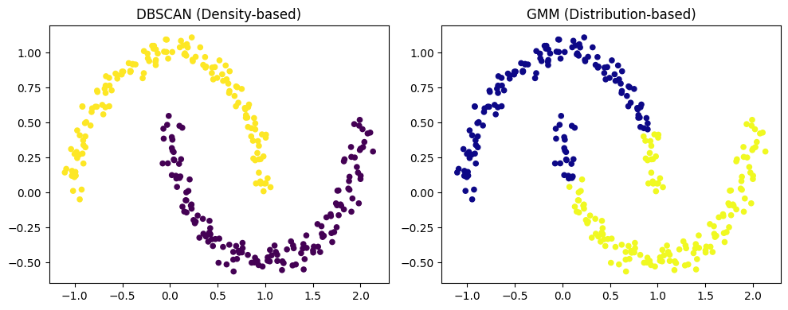
    


### 3-6) Regression : Linear Regression, 기타 Regression 방법, KNN Regression

1. Linear Regression


```python
from sklearn.linear_model import LinearRegression
from sklearn.datasets import make_regression

X_reg, y_reg = make_regression(n_samples=200, n_features=5, noise=10, random_state=42)
model = LinearRegression().fit(X_reg, y_reg)
print("회귀 계수:", model.coef_)
```

    회귀 계수: [ 3.32620404 10.66071369 64.13168045 17.72344841 70.29444969]
    

2. 기타 
- Ridge
- Lasso
- ElasticNet


```python
import numpy as np
import pandas as pd
from sklearn.datasets import load_diabetes
from sklearn.model_selection import train_test_split
from sklearn.linear_model import Ridge, Lasso, ElasticNet

# 0. 데이터 준비 (당뇨병 수치 예측 데이터)
X, y = load_diabetes(return_X_y=True)
X_train, X_test, y_train, y_test = train_test_split(X, y, test_size=0.2, random_state=42)

# 1. Ridge (L2 규제): 가중치의 제곱합을 최소화. 가중치를 0에 가깝게 만듦 (완전 0은 아님)
ridge = Ridge(alpha=1.0) # alpha는 규제 강도
ridge.fit(X_train, y_train)

# 2. Lasso (L1 규제): 가중치의 절대값 합을 최소화. 중요한 변수만 남기고 나머지는 0으로 만듦
lasso = Lasso(alpha=0.1)
lasso.fit(X_train, y_train)

# 3. ElasticNet (L1 + L2 혼합): Ridge와 Lasso의 장점을 결합
# l1_ratio가 1이면 Lasso, 0이면 Ridge와 동일
elastic = ElasticNet(alpha=0.1, l1_ratio=0.5)
elastic.fit(X_train, y_train)

# --- 결과 비교 (계수/가중치 확인) ---
coeff_df = pd.DataFrame({
    'Ridge': ridge.coef_,
    'Lasso': lasso.coef_,
    'ElasticNet': elastic.coef_
})

print("--- 모델별 계수(Weights) 비교 ---")
print(coeff_df.head()) # Lasso에서 0이 된 계수가 있는지 확인해보세요!

print("\n--- 결정계수(R2 Score) ---")
print(f"Ridge: {ridge.score(X_test, y_test):.4f}")
print(f"Lasso: {lasso.score(X_test, y_test):.4f}")
print(f"ElasticNet: {elastic.score(X_test, y_test):.4f}")
```

    --- 모델별 계수(Weights) 비교 ---
            Ridge       Lasso  ElasticNet
    0   45.367377    0.000000   10.830921
    1  -76.666086 -152.664779   -0.009514
    2  291.338832  552.697775   38.906865
    3  198.995817  303.365158   28.779233
    4   -0.530310  -81.365007   10.372007
    
    --- 결정계수(R2 Score) ---
    Ridge: 0.4192
    Lasso: 0.4719
    ElasticNet: 0.0987
    

3. KNN Regression
- k최근접 이웃 평균


```python
from sklearn.neighbors import KNeighborsRegressor

knn_reg = KNeighborsRegressor(n_neighbors=5).fit(X_reg, y_reg)
print("KNN 예측 샘플:", knn_reg.predict(X_reg[:3]))
```

    KNN 예측 샘플: [-19.61503014 -46.82602189   0.28709038]
    

### 3-7) Classification : Logistic Regression, 기타 Classification 방법, Naive Bayes, KNN Classification

1. Logistic Regression


```python
from sklearn.linear_model import LogisticRegression

X_clf, y_clf = make_classification(n_samples=300, random_state=42)
logit = LogisticRegression().fit(X_clf, y_clf)
print("로지스틱 회귀 정확도:", logit.score(X_clf, y_clf))
```

    로지스틱 회귀 정확도: 0.94
    

2. Naive Bayes


```python
from sklearn.naive_bayes import GaussianNB

nb = GaussianNB().fit(X_clf, y_clf)
print("Naive Bayes 정확도:", nb.score(X_clf, y_clf))
```

    Naive Bayes 정확도: 0.9233333333333333
    

3. KNN Classification
- 다수결 투표


```python
from sklearn.neighbors import KNeighborsClassifier

knn = KNeighborsClassifier(n_neighbors=5).fit(X_clf, y_clf)
print("KNN 분류 정확도:", knn.score(X_clf, y_clf))
```

    KNN 분류 정확도: 0.94
    

### 3-8) Tree Model : Decision Tree
- 분할 기준 : Entropy, Gini index, Information Gain
- Pruning (과적합 방지)
- 실기에서 RandomForest, XGBoost로 확장


```python
import pandas as pd
from sklearn.datasets import load_breast_cancer
from sklearn.model_selection import train_test_split
from sklearn.tree import DecisionTreeClassifier, plot_tree
from sklearn.ensemble import RandomForestClassifier
from xgboost import XGBClassifier # 설치 필요: pip install xgboost
import matplotlib.pyplot as plt

# 0. 데이터 준비
data = load_breast_cancer()
X_train, X_test, y_train, y_test = train_test_split(data.data, data.target, test_size=0.2, random_state=42)

# 1. Decision Tree (기본 모델 및 Pruning)
# criterion: 'gini' (기본값) 또는 'entropy' 선택 가능
# max_depth, min_samples_leaf: 과적합 방지를 위한 가지치기(Pruning) 파라미터
dt = DecisionTreeClassifier(
    criterion='gini', 
    max_depth=3,           # 나무의 최대 깊이 제한 (Pruning)
    min_samples_leaf=5,    # 리프 노드가 되기 위한 최소 샘플 수 (Pruning)
    random_state=42
)
dt.fit(X_train, y_train)

# 2. Random Forest (Bagging 방식의 확장)
# 여러 개의 결정 트리를 만들어 다수결로 결정
rf = RandomForestClassifier(n_estimators=100, max_depth=5, random_state=42)
rf.fit(X_train, y_train)

# 3. XGBoost (Boosting 방식의 확장)
# 이전 트리의 오차를 보완하며 순차적으로 학습 (실기 시험/경진대회 필수)
xgb = XGBClassifier(n_estimators=100, learning_rate=0.1, max_depth=3, random_state=42)
xgb.fit(X_train, y_train)

# --- 결과 확인 및 트리 시각화 ---
print(f"Decision Tree Accuracy: {dt.score(X_test, y_test):.4f}")
print(f"Random Forest Accuracy: {rf.score(X_test, y_test):.4f}")
print(f"XGBoost Accuracy: {xgb.score(X_test, y_test):.4f}")

# 결정 트리 구조 시각화 (깊이 제한 덕분에 한눈에 확인 가능)
plt.figure(figsize=(12, 8))
plot_tree(dt, feature_names=data.feature_names, class_names=data.target_names, filled=True)
plt.show()
```

    Decision Tree Accuracy: 0.9474
    Random Forest Accuracy: 0.9649
    XGBoost Accuracy: 0.9561
    


    
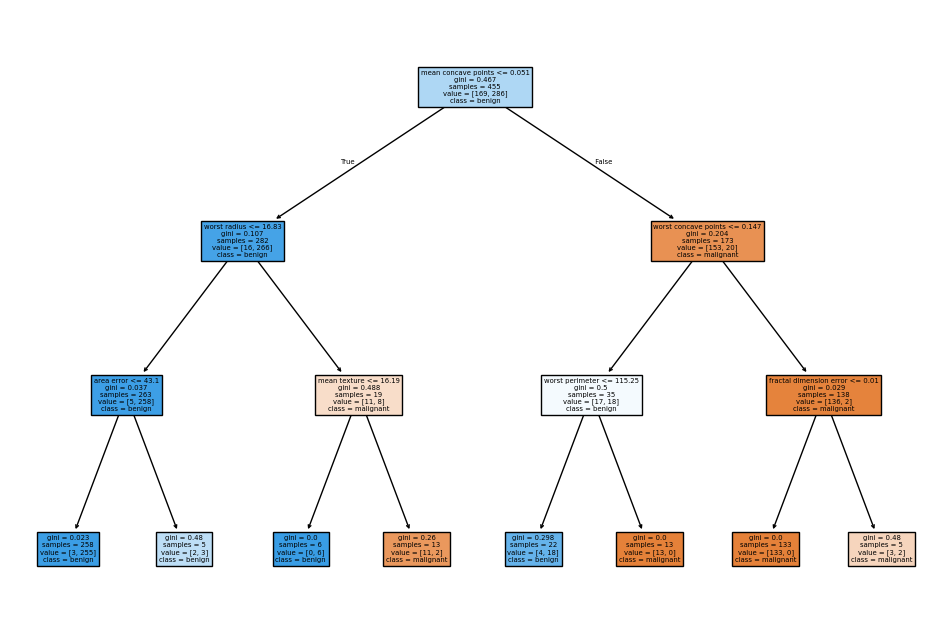
    


### 3-9) Recommendation : Association Rule, 기타 Recommendation

1. Association Rule (Apriori)


```python
import pandas as pd
from mlxtend.preprocessing import TransactionEncoder
from mlxtend.frequent_patterns import apriori, association_rules

# 0. 샘플 트랜잭션 데이터 (장바구니)
dataset = [['Milk', 'Bread', 'Cereal'],
           ['Soft Drink', 'Bread', 'Cereal'],
           ['Milk', 'Bread', 'Soft Drink', 'Cereal'],
           ['Milk', 'Soft Drink']]

# 1. 전처리: 데이터를 One-Hot 형태로 변환
te = TransactionEncoder()
te_ary = te.fit(dataset).transform(dataset)
df = pd.DataFrame(te_ary, columns=te.columns_)

# 2. Apriori 알고리즘: 빈번 아이템셋 추출 (최소 지지도 0.5 이상)
frequent_itemsets = apriori(df, min_support=0.5, use_colnames=True)

# 3. 연관 규칙 생성 (신뢰도 0.7 이상)
# 지지도(support), 신뢰도(confidence), 향상도(lift) 계산
rules = association_rules(frequent_itemsets, metric="confidence", min_threshold=0.7)

print("--- 연관 규칙 분석 결과 ---")
print(rules[['antecedents', 'consequents', 'support', 'confidence', 'lift']])
```

    --- 연관 규칙 분석 결과 ---
                antecedents consequents  support  confidence      lift
    0               (Bread)    (Cereal)     0.75         1.0  1.333333
    1              (Cereal)     (Bread)     0.75         1.0  1.333333
    2         (Bread, Milk)    (Cereal)     0.50         1.0  1.333333
    3        (Milk, Cereal)     (Bread)     0.50         1.0  1.333333
    4   (Bread, Soft Drink)    (Cereal)     0.50         1.0  1.333333
    5  (Soft Drink, Cereal)     (Bread)     0.50         1.0  1.333333
    

2. 기타
- Collaborate Filtering (User/Item-based), Matrix Factorization


```python
from sklearn.feature_extraction.text import TfidfVectorizer
from sklearn.metrics.pairwise import cosine_similarity

# 0. 샘플 영화 데이터
movies = pd.DataFrame({
    'title': ['Movie A', 'Movie B', 'Movie C', 'Movie D'],
    'genres': ['Action Adventure', 'Action Sci-Fi', 'Romance Drama', 'Adventure Sci-Fi']
})

# 1. 장르 텍스트를 벡터로 변환 (TF-IDF)
tfidf = TfidfVectorizer()
tfidf_matrix = tfidf.fit_transform(movies['genres'])

# 2. 코사인 유사도 계산
cosine_sim = cosine_similarity(tfidf_matrix, tfidf_matrix)

# 3. 'Movie A'와 유사한 영화 추천 함수
def get_recommendations(title, cosine_sim=cosine_sim):
    idx = movies[movies['title'] == title].index[0]
    sim_scores = list(enumerate(cosine_sim[idx]))
    # 유사도 순으로 정렬 (자기 자신 제외)
    sim_scores = sorted(sim_scores, key=lambda x: x[1], reverse=True)[1:]
    movie_indices = [i[0] for i in sim_scores]
    return movies['title'].iloc[movie_indices]

print("\n--- 'Movie A'와 비슷한 영화 추천 ---")
print(get_recommendations('Movie A'))
```

    
    --- 'Movie A'와 비슷한 영화 추천 ---
    1    Movie B
    3    Movie D
    2    Movie C
    Name: title, dtype: object
    
